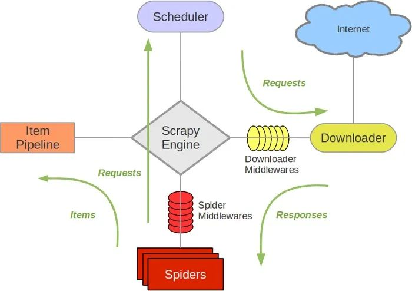

# Scrapy爬取书籍信息

Scrapy是由Python语言开发的一个快速、高层次的屏幕抓取和Web抓取框架，用于抓取Web站点并从页面中提取结构化的数据，只需要实现少量的代码，就能够快速的抓取。

Scrapy组件：
- Scrapy Engine
- Item
- Scheduler
- Spider
- Pipeline
- Downloader Middleware
- Spider Middleware
- Scheduler Middleware

文件目录：
- `python_scrapy_book`：默认创建的爬虫
    - `data`：存放爬虫结果的文件夹
    - `spiders`：存放爬虫代码文件的文件夹
        - `__init__.py`：模块定义文件
        - `book_spider.py`：待执行的爬虫代码文件
    - `__init__.py`：模块定义文件
    - `items.py`：目标文件
    - `middlewares.py`：中间件文件
    - `piplines.py`：管道文件
    - `settings.py`：设置文件
- `.gitignore`：指定Git应该忽略的故意untracked的文件
- `LINCENSE.md`：项目的开源许可证文件
- `README.md`：项目的说明文件
- `scrapy.cfg`：Scrapy项目的配置文件

实现流程：
1. 创建虚拟环境：`conda create --name spider python==3.7`
2. 进入虚拟环境：`conda activate spider`
3. 下载依赖：`pip install scrapy`
4. 创建工程：`scrapy startproject python_scrapy_book`
5. 实现爬虫
    1. 选择目标网页 
    2. 定义要抓取的数据item
    3. 编写提取数据的spider
6. 切换到`spiders`路径下运行爬虫：`scrapy runspider book_spider.py`
7. 数据存储
